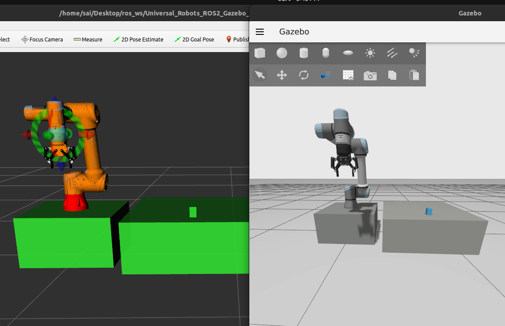

# arm-stack: UR5e Manipulation Workspace (ROS 2 Humble)

UR5e simulation in Gazebo Fortress driven by MoveIt2, built as clean local packages
(no Universal Robots vendor repos). Work in progress toward a full
perception-driven pick-and-place stack.



## Dependencies

ROS 2 Humble, MoveIt2, ros2_control/ros2_controllers, Gazebo Fortress
(`ros_gz`), `gz_ros2_control`, RViz2, and xacro.

## Architecture

```text
src/
  arm_description/      # UR5e URDF/Xacro, meshes, limits, kinematics (data only)
  arm_moveit_config/    # SRDF, OMPL/kinematics/controller config for move_group
  arm_bringup/          # Gazebo, ros2_control controllers, top-level launch
  arm_manipulation/     # C++ MoveIt clients: goto_*, scene_demo, trace_cartesian_path, pick/place demo
  robotiq_description/  # Vendored Robotiq 2F-85 description package only
```

Runtime flow: `arm_bringup` loads the URDF into Gazebo + `controller_manager` and
starts `move_group` (configured by `arm_moveit_config`). The `arm_manipulation`
nodes send goals to `move_group`, which plans (OMPL, group `ur_manipulator`) and
executes through `joint_trajectory_controller` back into Gazebo.

## Gripper

The end effector is a Robotiq 2F-85 attached at `tool0`. It has one actuated
joint (`robotiq_85_left_knuckle_joint`, mimic joints handled by
`gz_ros2_control`), its own `gripper` planning group with `open`/`closed`
named states, a `tcp` grasp frame at the fingertips, and a
`GripperCommand` action interface via `gripper_controller`.

## Build

```bash
source /opt/ros/humble/setup.bash
rosdep install --ignore-src --from-paths src -y
colcon build --symlink-install
source install/setup.bash
```

## Normal Robot Flow

Use this when you only need the robot, MoveIt, controllers, and RViz.

```bash
ros2 launch arm_bringup bringup.launch.py
```

Starts Gazebo Fortress, `robot_state_publisher`, `gz_ros2_control`,
`joint_state_broadcaster`, `joint_trajectory_controller`, `gripper_controller`,
`move_group`, and RViz with the plain robot setup.

Useful nodes:

```bash
ros2 run arm_manipulation goto_named        # go to SRDF "home" (or: goto_named up)
ros2 run arm_manipulation goto_pose         # plan+execute to a Cartesian pose
ros2 run arm_manipulation scene_demo        # collision object + attach/detach demo
```

## Static Pick/Place Flow

Use this for the known single blue box at the fixed pose used by
`pick_place_static`.

```bash
ros2 launch arm_bringup pick_and_place_bringup.launch.py spawn_randomly:=false
```

Loads the Ignition table world, raises the UR5e on the platform, and uses the
pick/place initial joint pose.


```bash
ros2 run arm_manipulation pick_place_static
ros2 run arm_manipulation pick_place_static --ros-args -p grasp_tcp_z_offset:=-0.01 -p grasp_close_position:=0.61 -p grasp_max_effort:=30.0
```

Useful static parameters:

```bash
ros2 run arm_manipulation pick_place_static --ros-args \
  -p box_x:=0.0 -p box_y:=0.75 -p box_z:=0.33 \
  -p place_x:=0.25 -p place_y:=0.75 -p place_z:=0.33 \
  -p grasp_close_position:=0.62 -p grasp_max_effort:=32.0
```

## Dynamic Pick/Place Pipeline

Use this for random colored boxes, wrist-camera perception, and later dynamic
grasping. By default this launch deletes the fixed `pick_box`, spawns three
random colored boxes near the static-box area, and adds the drop bin.

Terminal 1:

```bash
ros2 launch arm_bringup pick_and_place_bringup.launch.py
```

Useful launch parameters:

```bash
ros2 launch arm_bringup pick_and_place_bringup.launch.py spawn_randomly:=true random_box_count:=3
ros2 launch arm_bringup pick_and_place_bringup.launch.py enable_camera:=true
```

Terminal 2, move the wrist camera to the detect pose over the box area:

```bash
ros2 run arm_manipulation pick_place_dynamic
```

Useful detect-pose parameters:

```bash
ros2 run arm_manipulation pick_place_dynamic --ros-args \
  -p detect_x:=0.0 -p detect_y:=0.75 -p detect_camera_z:=0.65
```

Terminal 3, run perception:

```bash
ros2 launch arm_perception perception.launch.py
```

Debug the detector:

```bash
ros2 launch arm_perception perception.launch.py show_debug_window:=true
ros2 topic hz /detected_objects
ros2 topic echo /detected_objects --once
```

In RViz, add an `Image` display for:

```text
/object_detector/debug_image
```

Random scene utility:

```bash
ros2 run arm_bringup spawn_objects.py --reset
ros2 run arm_bringup spawn_objects.py --reset --count 5
```

Gripper actions:

```bash
ros2 action send_goal /gripper_controller/gripper_cmd control_msgs/action/GripperCommand "{command: {position: 0.8, max_effort: 50.0}}"  # close
ros2 action send_goal /gripper_controller/gripper_cmd control_msgs/action/GripperCommand "{command: {position: 0.0, max_effort: 50.0}}"  # open
```

## Checks

```bash
xacro src/arm_description/urdf/ur.urdf.xacro sim_gazebo:=true | check_urdf -
ros2 control list_controllers   # expect joint_state_broadcaster, joint_trajectory_controller, gripper_controller active
ros2 action list | grep gripper_cmd
```

## Credits

The UR5e description (URDF/Xacro, meshes, kinematics) and the MoveIt/Gazebo
configs are derived from Universal Robots' open-source packages:
[Universal_Robots_ROS2_Description](https://github.com/UniversalRobots/Universal_Robots_ROS2_Description),
[Universal_Robots_ROS2_Driver](https://github.com/UniversalRobots/Universal_Robots_ROS2_Driver), and
[Universal_Robots_ROS2_Gazebo_Simulation](https://github.com/UniversalRobots/Universal_Robots_ROS2_Gazebo_Simulation),
under the BSD-3-Clause license. Thanks to Universal Robots and the ROS
community for maintaining them.

The Robotiq 2F-85 gripper description (URDF/Xacro and meshes) is vendored from
[PickNikRobotics/ros2_robotiq_gripper](https://github.com/PickNikRobotics/ros2_robotiq_gripper),
under the BSD-3-Clause license; only the description assets are included, not
the hardware driver packages. Thanks to PickNik Robotics and Robotiq for the
open-source gripper support.
